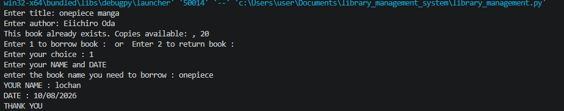
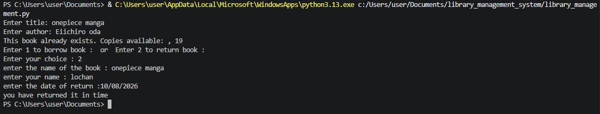

# Library Management System (version - 1)

A command-line library management system built in Python that lets you add books, borrow them, and return them — with borrower and due-date tracking backed by persistent JSON storage so the data survives between runs.

**Status:** Version 1 — core add/borrow/return flow is working, more features planned.

## How It Works

On each run, the program first checks if a book already exists (by title); if it's new, it's added to the JSON file with a default of 20 copies. You're then asked to choose between borrowing (1) or returning (2) a book — borrowing records your name and due date and reduces available copies, while returning removes your borrower record, restores the copy count, and charges a ₹2/day penalty if the book is returned more than 15 days late.


## Demo


**Adding & Borrowing a book:**



**Returning a book:**



## Features
- Add a new book 
- Borrow a book with borrower name and due date
- Return a book with automatic late-fee calculation (₹2/day after 15 days)
- Data persists across sessions via JSON file storage (`data/library.json`)

## Tech Stack
- Python 3
- `json`, `datetime`, `pathlib` (standard library only)

## How to Run
```bash
python library_management.py
```
